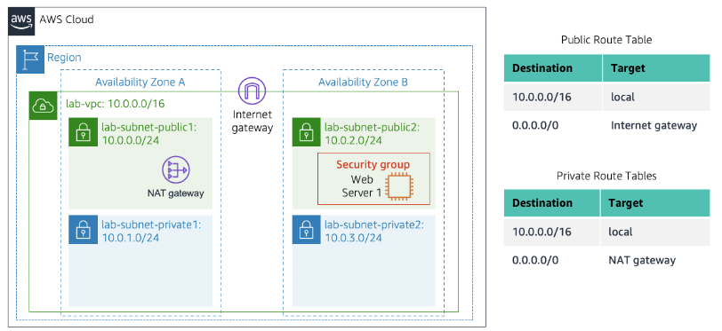

# AWS Foundations > Module 5 > Lab 2

## [Contents](#contents)

- [Elements](#elements)
- [Amazon VPC](#amazon-vpc)

Build your VPC and Launch a Web Server.

## Elements

- Use Amazon Virtual Private Cloud (VPC) to create your own VPC.
- Add additional components to produce a customized network.
- Create a security group.
- Configure and customize an EC2 instance to run a web server.
- Launch the EC2 instance to run in a subnet in the VPC.

## Amazon VPC

Virtual defined network. Benefits using scale of AWS. VPC can span multiple Availability Zones.

- Create VPC.
- Create subnets.
- Configure a security group.
- Launch EC2 instance in to VPC.

## Target Infrastructure

Lab aims to create the following:

## Steps

### Create VPC

